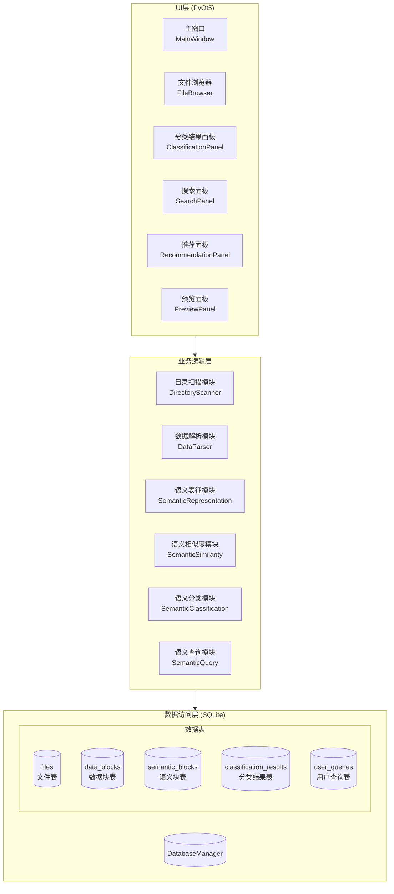
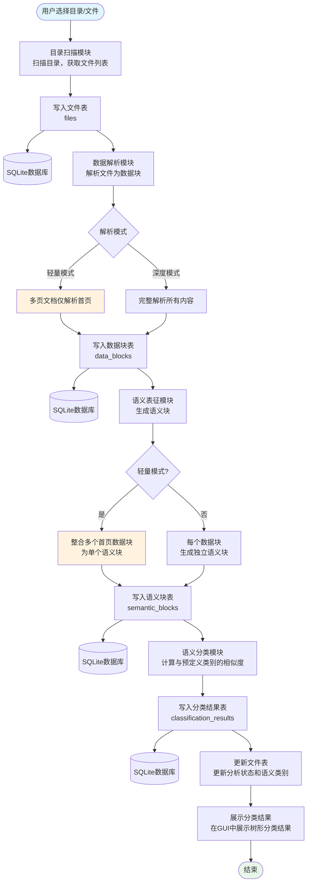
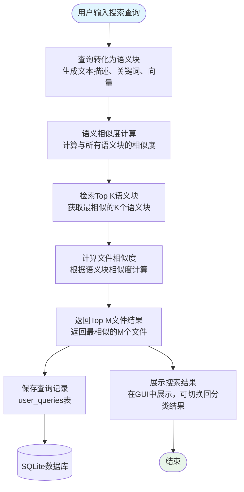
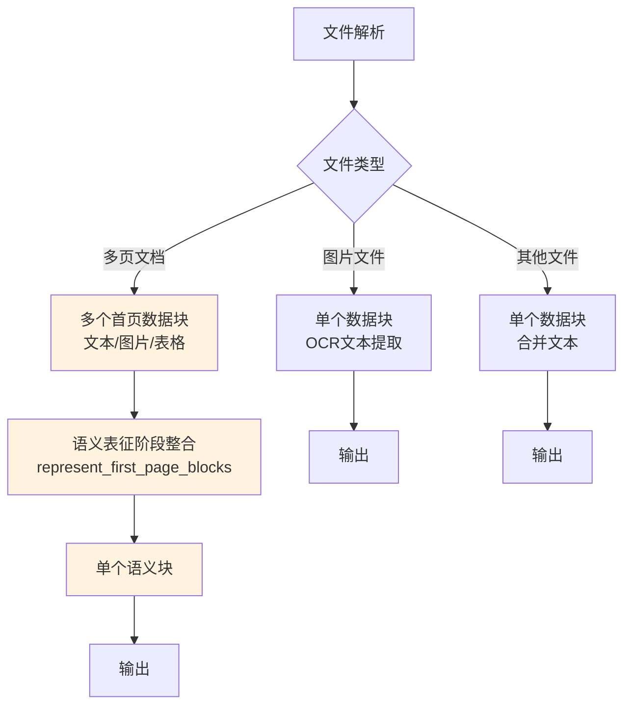
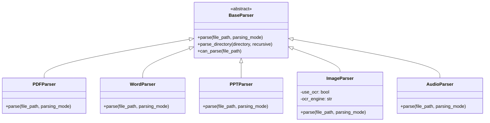
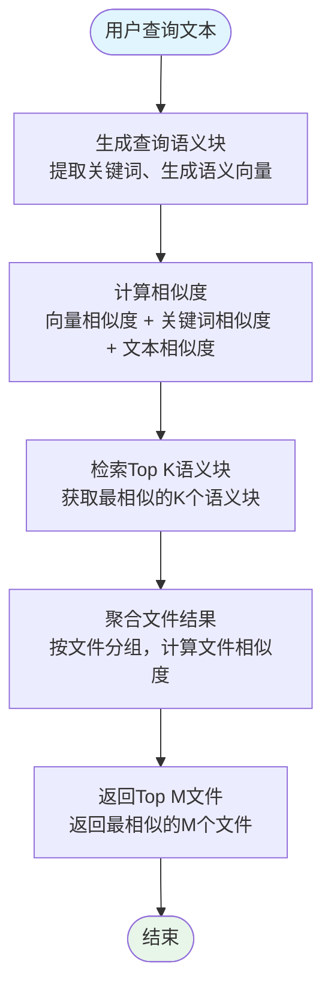

# File Analyzer 项目程序设计文档

## 1. 项目概述

File Analyzer 是一个多功能文件分析工程，支持多种文件格式（PPT、Word、PDF、WAV、JPG等）的解析和分析。通过数据解析、语义表征、语义相似度计算和语义分类等模块，实现对不同模态文件的统一处理和分析。

### 1.1 主要功能

- **多格式文件解析**：支持PDF、Word、PPT、图片和音频等多种文件格式的解析
- **语义表征**：将不同模态的数据转化为统一的语义表示（文本描述、关键词、语义向量）
- **语义相似度计算**：融合向量相似度、BM25分数和关键词相似度
- **语义分类**：基于预定义语义类别进行文件分类
- **OCR文本提取**：支持图片OCR识别，提取图片中的文字内容
- **数据库持久化**：使用SQLite存储文件信息、数据块、语义块和分类结果
- **GUI界面**：提供PyQt5图形用户界面，支持目录扫描、文件分析和结果展示

### 1.2 技术栈

- **编程语言**：Python 3.10+
- **GUI框架**：PyQt5
- **数据库**：SQLite3
- **核心依赖**：
  - sentence-transformers（语义向量生成）
  - paddleocr/paddlepaddle（OCR文字识别）
  - jieba（中文分词）
  - numpy（数值计算）
  - pdfplumber/pymupdf（PDF解析）
  - python-pptx（PPT解析）
  - python-docx（Word解析）
  - Pillow（图片处理）

## 2. 系统架构

### 2.1 整体架构



### 2.2 模块说明

| 模块 | 功能描述 | 主要文件 |
|------|---------|----------|
| **UI模块** | 提供图形用户界面 | `ui/main_window.py`, `ui/file_browser.py`, `ui/classification_panel.py` |
| **目录扫描模块** | 扫描本地目录，获取文件列表 | `directory_scanner/directory_scanner.py` |
| **数据解析模块** | 解析不同格式文件为数据块 | `data_parser/data_parser.py`, `data_parser/pdf_parser.py`, `data_parser/image_parser.py` |
| **语义表征模块** | 生成语义块（文本描述、关键词、向量） | `semantic_representation/semantic_representation.py` |
| **语义相似度模块** | 计算语义块之间的相似度 | `semantic_similarity/semantic_similarity.py` |
| **语义分类模块** | 基于预定义类别对文件分类 | `semantic_classification/semantic_classification.py` |
| **语义查询模块** | 支持多种方式的语义查询 | `semantic_query/semantic_query.py` |
| **数据库模块** | SQLite数据库操作 | `database/database.py` |

### 2.3 核心业务流程



### 2.4 语义搜索流程



## 3. 模块设计

### 3.1 数据解析模块

#### 3.1.1 功能说明

数据解析模块负责将不同格式的文件解析为统一的数据块（DataBlock），支持PDF、Word、PPT、图片和音频等多种格式。

#### 3.1.2 解析模式

模块支持两种解析模式：

| 模式 | 说明 | 适用场景 |
|------|------|----------|
| **轻量解析** (mode=1) | 多页文档仅解析首页，生成多个数据块；所有类型最终整合为单个语义块 | 快速预览、初步分析 |
| **深度解析** (mode=2) | 完整解析文件，保留所有数据块，每个数据块生成独立语义块 | 详细分析、全文索引 |

#### 3.1.3 轻量解析模式详细逻辑

轻量解析模式针对不同文件类型的处理策略：

**1. 图片文件**
- 生成单个数据块，包含文件名和OCR提取的文本
- 数据块标记：`parsing_mode = 'light'`

**2. 多页文档（PDF、Word、PPT、Excel）**
- 仅保留首页的数据块（`page_number = 1`）
- 可能生成多个数据块（文本、图片、表格等）
- 数据块标记：`parsing_mode = 'light_first_page'`
- 在语义表征阶段，使用 `represent_first_page_blocks` 方法整合所有首页数据块

**3. 其他类型文件**
- 合并所有文本内容
- 创建单个数据块
- 数据块标记：`parsing_mode = 'light'`

**轻量模式数据块处理流程：**



**represent_first_page_blocks 整合逻辑：**

1. **文本收集**：遍历所有首页数据块
   - 图片数据块：使用OCR提取文本
   - 文本数据块：直接使用文本内容

2. **文本拼接**：将所有文本片段用换行符连接

3. **长度截断**：按照配置的最大长度（默认256）截断

4. **语义表征生成**：
   - 生成文本描述
   - 提取关键词
   - 生成语义向量

5. **数据库写入**：
   - 语义块关联所有数据块ID（`data_block_ids`字段）
   - 记录整合元数据（源数据块数量、原始文本长度等）

#### 3.1.4 图片解析与OCR

图片解析器 (`ImageParser`) 支持OCR文字识别：

```python
class ImageParser(BaseParser):
    def __init__(self, use_ocr: bool = True, ocr_engine: str = 'paddleocr'):
        self.use_ocr = use_ocr  # 是否启用OCR
        self.ocr_engine = ocr_engine  # OCR引擎: paddleocr
```

**OCR处理流程**：
1. 生成基础数据块：`[Image file: 文件名]`
2. 使用PaddleOCR识别图片中的文字
3. 将OCR结果与基础描述拼接
4. 返回完整的数据块列表

#### 3.1.5 类关系



#### 3.1.6 核心方法

| 方法名 | 参数 | 返回值 | 功能描述 |
|-------|------|--------|----------|
| `parse` | file_path: str, parsing_mode: int | List[DataBlock] | 解析文件为数据块 |
| `parse_directory` | directory: str, recursive: bool | Dict[str, List[DataBlock]] | 解析目录下的文件 |
| `can_parse` | file_path: str | bool | 检查是否支持该文件格式 |

### 3.2 语义表征模块

#### 3.2.1 功能说明

语义表征模块负责将数据块转化为统一的语义表示（SemanticBlock），包括文本描述、关键词和语义向量。

#### 3.2.2 图片文本提取

图片文本提取器 (`ImageTextExtractor`) 支持OCR方式提取图片文字：

```python
class ImageTextExtractor:
    def __init__(self, use_ocr: bool = True, ocr_model: str = 'paddleocr'):
        self.use_ocr = use_ocr
        self.ocr_model = ocr_model
```

**文本提取格式**：
```
[Image file: 文件名.jpg]
OCR识别的文本内容...
```

#### 3.2.3 嵌入模型

支持多种嵌入模型：

| 模型类型 | 说明 | 配置项 |
|----------|------|--------|
| SentenceTransformer | 本地预训练模型 | `embedding.type: sentence_transformer` |
| Text2Vec | 中文文本向量模型 | `embedding.type: text2vec` |
| OpenAI | OpenAI API接口 | `embedding.type: openai` |

默认使用模型：`paraphrase-multilingual-MiniLM-L12-v2`

#### 3.2.4 首页数据块整合（轻量模式）

针对轻量解析模式下的多页文档首页，提供专门的数据块整合方法：

**represent_first_page_blocks 方法**

```python
def represent_first_page_blocks(
    self, 
    blocks: List[DataBlock], 
    db_manager=None, 
    file_id: int = None,
    max_length: int = 256
) -> SemanticBlock
```

**处理流程：**

1. **文本收集**
   - 遍历所有首页数据块
   - 图片类型：调用OCR提取文本
   - 文本类型：直接使用文本内容

2. **文本拼接与截断**
   - 将所有文本片段用换行符连接
   - 按照最大长度（默认256）截断

3. **语义表征生成**
   - 生成文本描述
   - 提取关键词
   - 生成语义向量

4. **数据库写入**
   - 语义块关联所有数据块ID（`data_block_ids`字段）
   - 记录整合元数据

**语义块元数据：**
```python
{
    'source_blocks_count': len(blocks),      # 源数据块数量
    'combined_text_length': original_length, # 原始文本长度
    'max_length': max_length,                # 最大长度限制
    'parsing_mode': 'light_first_page_combined'
}
```

#### 3.2.5 核心方法

| 方法名 | 参数 | 返回值 | 功能描述 |
|-------|------|--------|----------|
| `represent` | block: DataBlock, db_manager, data_block_id, file_id | SemanticBlock | 生成语义块并写入数据库 |
| `represent_batch` | blocks: List[DataBlock] | List[SemanticBlock] | 批量生成语义块 |
| `represent_first_page_blocks` | blocks, db_manager, file_id, max_length | SemanticBlock | 整合首页多个数据块为单个语义块（轻量模式） |
| `encode_single` | text: str | np.ndarray | 编码单个文本为语义向量 |
| `extract` | text: str | List[str] | 提取文本关键词（使用jieba） |

### 3.3 语义分类模块

#### 3.3.1 功能说明

语义分类模块负责将语义块分类到预定义的语义类别中，支持基于相似度的分类方法。该模块通过计算语义块与各预定义类别之间的相似度，选择最匹配的类别作为分类结果。

#### 3.3.2 分类方法

支持两种分类方法：

| 方法 | 说明 | 配置项 |
|------|------|--------|
| **similarity** | 使用语义相似度计算分类 | `classification.method: similarity` |
| **clustering** | 使用语义聚类分类 | `classification.method: clustering` |

#### 3.3.3 预定义语义类别

系统内置8个预定义语义类别：

| 类别名称 | 描述 | 关键词 |
|---------|------|--------|
| **技术文档** | 技术规范、API文档、技术手册等 | 技术、API、接口、开发、代码、系统、架构、配置、部署、服务器 |
| **商业报告** | 商业计划、市场分析、财务报告等 | 市场、销售、收入、利润、客户、竞争、战略、投资、商业、业务 |
| **学术论文** | 研究论文、学术文章、研究报告等 | 研究、实验、方法、结果、分析、理论、模型、数据、论文、引用 |
| **会议演示** | 会议PPT、演讲稿、培训材料等 | 会议、演示、培训、演讲、PPT、展示、介绍、汇报、方案、计划 |
| **合同协议** | 合同、协议、法律文件等 | 合同、协议、条款、甲方、乙方、法律、责任、义务、权利、签署 |
| **产品说明** | 产品手册、使用指南、说明书等 | 产品、功能、使用、操作、说明、指南、特性、规格、型号、安装 |
| **新闻资讯** | 新闻报道、新闻稿、媒体文章等 | 新闻、报道、发布、消息、媒体、记者、事件、宣布、最新、动态 |
| **个人文档** | 简历、个人陈述、信函等 | 个人、简历、经历、教育、技能、自我、介绍、申请、工作、职位 |

#### 3.3.4 分类计算方法详解

##### 3.3.4.1 整体分类流程

```
输入：语义块 SemanticBlock
       │
       ▼
┌─────────────────────────────────────────────────────────────┐
│ 步骤1：类别向量预计算                                         │
│ • 对每个预定义类别，将其描述和关键词拼接成文本                  │
│ • 使用嵌入模型将文本编码为语义向量                             │
│ • 存储类别向量，避免重复计算                                   │
└─────────────────────────────────────────────────────────────┘
       │
       ▼
┌─────────────────────────────────────────────────────────────┐
│ 步骤2：多维度相似度计算                                       │
│ • 向量相似度：语义块向量与类别向量的余弦相似度                  │
│ • BM25分数：基于文本内容的BM25算法得分                        │
│ • 关键词相似度：语义块关键词与类别关键词的Jaccard相似度        │
└─────────────────────────────────────────────────────────────┘
       │
       ▼
┌─────────────────────────────────────────────────────────────┐
│ 步骤3：融合相似度得分                                         │
│ • 根据配置的权重，加权融合三种相似度得分                       │
│ • fused_score = Σ(similarity_i × weight_i)                   │
└─────────────────────────────────────────────────────────────┘
       │
       ▼
┌─────────────────────────────────────────────────────────────┐
│ 步骤4：类别选择与置信度计算                                   │
│ • 选择融合得分最高的类别作为最佳匹配                           │
│ • 计算置信度：基于最佳得分与次佳得分的比值                     │
└─────────────────────────────────────────────────────────────┘
       │
       ▼
输出：分类结果 ClassificationResult
       (category_name, confidence, all_scores)
```

##### 3.3.4.2 向量相似度计算

**计算公式**：
```
cosine_similarity(A, B) = (A · B) / (||A|| × ||B||)
```

**计算步骤**：
1. 获取语义块的语义向量 `V_block`
2. 获取预定义类别的语义向量 `V_category`
3. 计算两个向量的点积
4. 计算两个向量的模长
5. 计算余弦相似度（值域：[-1, 1]，实际使用 [0, 1]）

**代码示例**：
```python
import numpy as np

def cosine_similarity(vec1: np.ndarray, vec2: np.ndarray) -> float:
    """计算两个向量的余弦相似度"""
    dot_product = np.dot(vec1, vec2)
    norm1 = np.linalg.norm(vec1)
    norm2 = np.linalg.norm(vec2)
    
    if norm1 == 0 or norm2 == 0:
        return 0.0
    
    return dot_product / (norm1 * norm2)
```

##### 3.3.4.3 BM25分数计算

**BM25算法原理**：
BM25是一种基于概率检索框架的排序函数，用于评估文档与查询的相关性。

**计算公式**：
```
BM25(D, Q) = Σ IDF(q_i) × [f(q_i, D) × (k1 + 1)] / [f(q_i, D) + k1 × (1 - b + b × |D| / avgdl)]

其中：
- D：文档（语义块文本描述）
- Q：查询（类别描述和关键词）
- q_i：查询中的第i个词
- f(q_i, D)：词q_i在文档D中的词频
- |D|：文档长度
- avgdl：平均文档长度
- k1：控制词频饱和度的参数（通常取1.2-2.0）
- b：控制文档长度归一化的参数（通常取0.75）
```

**IDF计算**：
```
IDF(q_i) = log[(N - n(q_i) + 0.5) / (n(q_i) + 0.5)]

其中：
- N：文档总数
- n(q_i)：包含词q_i的文档数
```

**计算步骤**：
1. 对语义块文本进行分词
2. 对类别描述和关键词进行分词
3. 计算每个类别词在语义块文本中的词频
4. 计算IDF值
5. 应用BM25公式计算得分

##### 3.3.4.4 关键词相似度计算

**Jaccard相似度**：
```
Jaccard(A, B) = |A ∩ B| / |A ∪ B|

其中：
- A：语义块关键词集合
- B：类别关键词集合
- |A ∩ B|：交集大小（共同关键词数）
- |A ∪ B|：并集大小（所有不重复关键词数）
```

**计算步骤**：
1. 提取语义块的关键词列表
2. 获取预定义类别的关键词列表
3. 计算两个集合的交集
4. 计算两个集合的并集
5. 计算Jaccard相似度（值域：[0, 1]）

**代码示例**：
```python
def jaccard_similarity(keywords1: List[str], keywords2: List[str]) -> float:
    """计算两组关键词的Jaccard相似度"""
    set1 = set(keywords1)
    set2 = set(keywords2)
    
    intersection = len(set1 & set2)
    union = len(set1 | set2)
    
    if union == 0:
        return 0.0
    
    return intersection / union
```

##### 3.3.4.5 融合相似度计算

**权重配置**：
```json
{
    "similarity_weights": {
        "vector_weight": 0.35,
        "bm25_weight": 0.3,
        "keyword_weight": 0.35,
        "time_weight": 0.0,
        "location_weight": 0.0
    }
}
```

**融合公式**：
```
fused_score = (vector_sim × vector_weight) 
            + (bm25_score × bm25_weight) 
            + (keyword_sim × keyword_weight)
            + (time_sim × time_weight)
            + (location_sim × location_weight)
```

**归一化处理**：
- 向量相似度：已在[-1, 1]范围内，映射到[0, 1]
- BM25分数：需要进行归一化处理（如使用sigmoid或线性归一化）
- 关键词相似度：已在[0, 1]范围内

**计算步骤**：
1. 分别计算三种相似度得分
2. 对BM25分数进行归一化
3. 根据配置的权重进行加权求和
4. 得到最终的融合相似度得分

##### 3.3.4.6 类别选择与置信度计算

**最佳类别选择**：
```python
# 对所有类别计算融合相似度
scores = {}
for category in categories:
    scores[category.name] = compute_fused_similarity(semantic_block, category)

# 选择得分最高的类别
best_category = max(scores, key=scores.get)
best_score = scores[best_category]
```

**置信度计算**：
```
confidence = best_score / sum(scores) 

或

confidence = best_score / (best_score + second_best_score)

或

confidence = (best_score - mean(scores)) / std(scores)  # Z-score方法
```

**实际采用的置信度计算**：
```python
def calculate_confidence(scores: Dict[str, float], best_category: str) -> float:
    """计算分类置信度"""
    best_score = scores[best_category]
    
    # 获取次高得分
    sorted_scores = sorted(scores.values(), reverse=True)
    if len(sorted_scores) >= 2:
        second_best_score = sorted_scores[1]
    else:
        second_best_score = 0.0
    
    # 避免除零
    if best_score + second_best_score == 0:
        return 0.0
    
    # 置信度 = 最佳得分 / (最佳得分 + 次佳得分)
    confidence = best_score / (best_score + second_best_score)
    
    return confidence
```

**置信度解释**：
- confidence > 0.7：高置信度，分类结果可信
- 0.5 < confidence <= 0.7：中等置信度，建议人工确认
- confidence <= 0.5：低置信度，可能需要重新分类或使用其他方法

##### 3.3.4.7 完整分类算法流程

```python
class SemanticClassification:
    def classify(self, semantic_block: SemanticBlock) -> ClassificationResult:
        """
        对语义块进行分类
        
        完整流程：
        1. 检查是否已初始化类别向量
        2. 对每个预定义类别计算多维度相似度
        3. 融合相似度得分
        4. 选择最佳类别
        5. 计算置信度
        6. 返回分类结果
        """
        # 步骤1：确保类别向量已初始化
        if not self._category_vectors_initialized:
            self._initialize_category_vectors()
        
        # 步骤2：计算各维度相似度
        scores = {}
        for category in self.categories:
            # 2.1 向量相似度
            vector_sim = self._compute_vector_similarity(
                semantic_block.semantic_vector,
                category.semantic_vector
            )
            
            # 2.2 BM25分数
            bm25_score = self._compute_bm25_score(
                semantic_block.text_description,
                category.description + ' '.join(category.keywords)
            )
            
            # 2.3 关键词相似度
            keyword_sim = self._compute_keyword_similarity(
                semantic_block.keywords,
                category.keywords
            )
            
            # 步骤3：融合相似度
            fused_score = (
                vector_sim * self.weights['vector_weight'] +
                bm25_score * self.weights['bm25_weight'] +
                keyword_sim * self.weights['keyword_weight']
            )
            
            scores[category.name] = fused_score
        
        # 步骤4：选择最佳类别
        best_category = max(scores, key=scores.get)
        best_score = scores[best_category]
        
        # 步骤5：计算置信度
        confidence = self._calculate_confidence(scores, best_category)
        
        # 步骤6：返回结果
        return ClassificationResult(
            category_name=best_category,
            confidence=confidence,
            all_scores=scores
        )
```

##### 3.3.4.8 性能优化策略

**1. 类别向量缓存**：
```python
class SemanticClassification:
    def __init__(self):
        self._category_vectors = {}  # 缓存类别向量
        self._category_vectors_initialized = False
    
    def _initialize_category_vectors(self):
        """预计算并缓存所有类别的语义向量"""
        for category in self.categories:
            # 将类别描述和关键词拼接
            category_text = f"{category.description} {' '.join(category.keywords)}"
            
            # 编码为向量并缓存
            self._category_vectors[category.name] = self.embedding_model.encode_single(category_text)
        
        self._category_vectors_initialized = True
```

**2. 批量分类优化**：
```python
def classify_batch(self, semantic_blocks: List[SemanticBlock]) -> List[ClassificationResult]:
    """批量分类，利用矩阵运算加速"""
    # 将所有语义块向量堆叠成矩阵
    block_vectors = np.stack([block.semantic_vector for block in semantic_blocks])
    
    # 将所有类别向量堆叠成矩阵
    category_vectors = np.stack([
        self._category_vectors[cat.name] for cat in self.categories
    ])
    
    # 批量计算余弦相似度（矩阵运算）
    similarity_matrix = cosine_similarity_matrix(block_vectors, category_vectors)
    
    # 对每个语义块选择最佳类别
    results = []
    for i, block in enumerate(semantic_blocks):
        scores = {
            self.categories[j].name: similarity_matrix[i, j]
            for j in range(len(self.categories))
        }
        
        best_category = max(scores, key=scores.get)
        confidence = self._calculate_confidence(scores, best_category)
        
        results.append(ClassificationResult(
            category_name=best_category,
            confidence=confidence,
            all_scores=scores
        ))
    
    return results
```

**3. 相似度阈值过滤**：
```python
def classify_with_threshold(self, semantic_block: SemanticBlock, 
                           min_confidence: float = 0.5) -> Optional[ClassificationResult]:
    """带阈值的分类，低于阈值的返回None"""
    result = self.classify(semantic_block)
    
    if result.confidence < min_confidence:
        # 置信度太低，可能是不属于任何预定义类别
        return None
    
    return result
```

#### 3.3.5 相似度权重配置

```json
{
    "vector_weight": 0.35,
    "bm25_weight": 0.3,
    "keyword_weight": 0.35,
    "time_weight": 0.0,
    "location_weight": 0.0
}
```

**权重调整建议**：

| 场景 | 推荐权重配置 | 说明 |
|------|-------------|------|
| **通用场景** | vector: 0.35, bm25: 0.30, keyword: 0.35 | 平衡考虑语义和关键词 |
| **关键词重要** | vector: 0.20, bm25: 0.30, keyword: 0.50 | 强调关键词匹配 |
| **语义重要** | vector: 0.60, bm25: 0.20, keyword: 0.20 | 强调语义理解 |
| **长文档** | vector: 0.40, bm25: 0.40, keyword: 0.20 | 增加BM25权重 |

#### 3.3.6 核心方法

| 方法名 | 参数 | 返回值 | 功能描述 |
|-------|------|--------|----------|
| `classify` | semantic_block: SemanticBlock | ClassificationResult | 对语义块进行分类 |
| `classify_batch` | semantic_blocks: List[SemanticBlock] | List[ClassificationResult] | 批量分类 |
| `get_category_names` | 无 | List[str] | 获取所有类别名称 |
| `compute_vector_similarity` | vec1: np.ndarray, vec2: np.ndarray | float | 计算向量相似度 |
| `compute_bm25_score` | text: str, query: str | float | 计算BM25分数 |
| `compute_keyword_similarity` | keywords1: List[str], keywords2: List[str] | float | 计算关键词相似度 |
| `calculate_confidence` | scores: Dict[str, float], best_category: str | float | 计算分类置信度 |

### 3.4 语义相似度模块

#### 3.4.1 功能说明

语义相似度计算模块负责计算不同语义块之间的相似度，融合向量相似度、BM25分数和关键词相似度。

#### 3.4.2 相似度计算方法

| 相似度类型 | 权重默认值 | 说明 |
|-----------|-----------|------|
| **向量相似度** | 0.35 | 使用余弦相似度计算语义向量之间的相似度 |
| **BM25分数** | 0.3 | 基于文本的BM25算法计算相似度 |
| **关键词相似度** | 0.35 | 使用Jaccard相似度计算关键词之间的相似度 |
| **时间相似度** | 0.0 | 计算时间信息的相似度 |
| **地点相似度** | 0.0 | 计算地点信息的相似度 |

#### 3.4.3 核心方法

| 方法名 | 参数 | 返回值 | 功能描述 |
|-------|------|--------|----------|
| `fit` | target_blocks: List[SemanticBlock] | 无 | 拟合目标语义块 |
| `compute_similarity` | query_block, target_block | SimilarityResult | 计算两个语义块之间的相似度 |
| `search` | query_block, top_k, min_score | List[SimilarityResult] | 搜索最相似的语义块 |

### 3.5 语义查询模块

#### 3.5.1 功能说明

语义查询模块提供基于语义相似度的文件检索功能。用户输入查询文本后，系统将查询转化为语义块，计算与数据库中所有语义块的相似度，返回最相关的文件列表。

#### 3.5.2 查询流程



#### 3.5.3 相似度计算方法

使用与语义分类模块相同的相似度计算方式：

| 相似度类型 | 权重 | 计算方法 |
|-----------|------|---------|
| **向量相似度** | 0.35 | 余弦相似度 |
| **BM25分数** | 0.30 | 基于文本的BM25算法 |
| **关键词相似度** | 0.35 | Jaccard相似度 |

融合相似度公式：
```
fused_similarity = 0.35 * vector_sim + 0.30 * text_sim + 0.35 * keyword_sim
```

#### 3.5.4 核心类

**SemanticQuery**

```python
class SemanticQuery:
    def __init__(self, db_manager=None, config=None, config_path=None)
    def search(self, query_text: str, top_k: int = 10, top_m: int = 5) -> SearchResult
    def clear_cache(self) -> None
```

**数据结构**

```python
@dataclass
class SearchResult:
    query_text: str           # 查询文本
    top_k: int               # 检索的语义块数量
    top_m: int               # 返回的文件数量
    semantic_blocks: List[SemanticBlockResult]  # 语义块结果
    files: List[FileResult]  # 文件结果
    search_time: datetime    # 搜索时间

@dataclass
class FileResult:
    file_id: int             # 文件ID
    file_path: str           # 文件路径
    file_name: str           # 文件名
    similarity_score: float  # 相似度分数
    matched_blocks: List[SemanticBlockResult]  # 匹配的语义块
```

#### 3.5.5 核心方法

| 方法名 | 参数 | 返回值 | 功能描述 |
|-------|------|--------|----------|
| `search` | query_text, top_k, top_m | SearchResult | 执行语义搜索 |
| `_query_to_semantic_block` | query_text: str | SemanticBlock | 将查询文本转化为语义块 |
| `_find_top_k_semantic_blocks` | query_block, top_k | List[SemanticBlockResult] | 查找最相似的K个语义块 |
| `_compute_similarity` | query_block, target_block | float | 计算两个语义块的相似度 |
| `_calculate_file_similarity` | semantic_block_results, top_m | List[FileResult] | 计算文件相似度并返回Top M |
| `clear_cache` | 无 | None | 清除语义块缓存 |

### 3.6 目录扫描模块

#### 3.6.1 功能说明

目录扫描模块负责扫描本地文件系统中的用户个人文件目录，支持Windows常用目录（桌面、下载、文档等）。

#### 3.6.2 支持的Windows目录

| 目录类型 | 说明 | 默认启用 |
|---------|------|---------|
| **Desktop** | 桌面 | ✓ |
| **Downloads** | 下载 | ✓ |
| **Documents** | 文档 | ✓ |
| **Pictures** | 图片 | ✓ |
| **Videos** | 视频 | ✗ |
| **Music** | 音乐 | ✗ |

#### 3.6.3 系统目录过滤

模块会自动排除以下Windows系统目录：
- `C:\Windows`
- `C:\Program Files`
- `C:\Program Files (x86)`
- `C:\ProgramData`
- `C:\$Recycle.Bin`
- `C:\System Volume Information`
- 隐藏文件和系统文件

#### 3.6.4 核心方法

| 方法名 | 参数 | 返回值 | 功能描述 |
|-------|------|--------|----------|
| `scan_default_directories` | 无 | Dict[str, List[str]] | 扫描所有启用的默认目录 |
| `scan_directory` | directory: str, recursive: bool | List[str] | 扫描指定目录 |
| `get_default_directories` | 无 | Dict[str, str] | 获取默认目录路径 |

### 3.7 数据库模块

#### 3.7.1 功能说明

数据库模块使用SQLite存储文件信息、数据块、语义块和分类结果，支持分析状态管理和历史数据清空。

#### 3.6.2 文件分析状态

```python
class FileStatus(IntEnum):
    PENDING = 0      # 待分析
    PRELIMINARY = 1  # 初步分析（标题和首页）
    DEEP = 2         # 深入分析（全文文本索引）
```

#### 3.7.2 文件分析状态

```python
class FileStatus(IntEnum):
    PENDING = 0      # 待分析
    PRELIMINARY = 1  # 初步分析（标题和首页）
    DEEP = 2         # 深入分析（全文文本索引）
```

#### 3.7.3 核心方法

| 方法名 | 参数 | 返回值 | 功能描述 |
|-------|------|--------|----------|
| `add_file` | file_path, file_name, file_size, file_type, ... | int | 添加文件记录，返回file_id |
| `add_data_block` | block_id, file_id, modality, content, ... | int | 添加数据块记录 |
| `add_semantic_block` | semantic_block_id, data_block_ids, file_id, ... | int | 添加语义块记录（支持多个数据块ID） |
| `add_classification_result` | file_id, semantic_block_id, category_name, ... | int | 添加分类结果记录 |
| `add_user_query` | query_text, query_vector, keywords, top_k, top_m, ... | int | 添加用户查询记录 |
| `update_file_status` | file_id, status | bool | 更新文件分析状态 |
| `update_file_semantic_categories` | file_id, categories | bool | 更新文件语义类别 |
| `get_files_by_status` | status | List[FileRecord] | 获取指定状态的文件 |
| `get_user_queries` | limit | List[UserQueryRecord] | 获取用户查询历史 |
| `clear_all_tables` | 无 | bool | 清空所有数据表 |

### 3.8 UI模块

#### 3.8.1 功能说明

UI模块基于PyQt5提供图形用户界面，包括主窗口、文件浏览器、分类结果面板、搜索面板等组件。

#### 3.8.2 主要组件

| 组件 | 文件 | 功能描述 |
|------|------|----------|
| **主窗口** | `main_window.py` | 应用程序主窗口，整合各功能模块 |
| **文件浏览器** | `file_browser.py` | 树形目录结构展示 |
| **分类结果面板** | `classification_panel.py` | 展示分类结果和搜索结果的树形结构，支持模式切换 |
| **搜索面板** | `search_panel.py` | 提供搜索功能 |
| **推荐面板** | `recommendation_panel.py` | 显示推荐内容 |
| **预览面板** | `preview_panel.py` | 文件预览功能 |

#### 3.8.3 核心功能

- **目录扫描**：扫描默认目录或选择目录
- **文件分析**：对选中目录的文件进行分析
- **分类展示**：以树形结构展示分类结果
- **语义搜索**：基于语义相似度的文件检索
- **结果切换**：支持在分类结果和搜索结果之间切换显示
- **清空历史**：一键清空所有分析数据

## 4. 数据库设计

### 4.1 文件表 (files)

| 字段名 | 数据类型 | 约束 | 描述 |
|-------|---------|------|------|
| `id` | INTEGER | PRIMARY KEY AUTOINCREMENT | 文件ID |
| `file_path` | TEXT | NOT NULL, UNIQUE | 文件完整路径 |
| `file_name` | TEXT | NOT NULL | 文件名 |
| `file_size` | INTEGER | NOT NULL | 文件大小（字节） |
| `file_type` | TEXT | NOT NULL | 文件类型（扩展名） |
| `modified_time` | TIMESTAMP | NOT NULL | 文件修改时间 |
| `created_time` | TIMESTAMP | NOT NULL | 文件创建时间 |
| `analysis_status` | INTEGER | DEFAULT 0 | 分析状态（0:待分析, 1:初步分析, 2:深入分析） |
| `semantic_categories` | TEXT | | 语义类别JSON [{"category": "...", "confidence": 0.85}, ...] |
| `directory_path` | TEXT | NOT NULL | 所在目录路径 |
| `added_time` | TIMESTAMP | DEFAULT CURRENT_TIMESTAMP | 添加到数据库时间 |

### 4.2 数据块表 (data_blocks)

| 字段名 | 数据类型 | 约束 | 描述 |
|-------|---------|------|------|
| `id` | INTEGER | PRIMARY KEY AUTOINCREMENT | 数据块ID |
| `block_id` | TEXT | NOT NULL, UNIQUE | 数据块唯一标识 |
| `file_id` | INTEGER | NOT NULL, FOREIGN KEY | 关联文件ID |
| `modality` | TEXT | NOT NULL | 模态类型（text/image/audio等） |
| `content` | BLOB | | 原始内容（二进制） |
| `text_content` | TEXT | | 文本内容 |
| `page_number` | INTEGER | | 页码（PDF/Word/PPT） |
| `position` | TEXT | | 位置信息JSON |
| `metadata` | TEXT | | 元数据JSON |
| `created_time` | TIMESTAMP | DEFAULT CURRENT_TIMESTAMP | 创建时间 |

### 4.3 语义块表 (semantic_blocks)

| 字段名 | 数据类型 | 约束 | 描述 |
|-------|---------|------|------|
| `id` | INTEGER | PRIMARY KEY AUTOINCREMENT | 语义块ID |
| `semantic_block_id` | TEXT | NOT NULL, UNIQUE | 语义块唯一标识 |
| `data_block_ids` | TEXT | | 关联数据块ID列表（JSON数组），支持一个语义块关联多个数据块 |
| `file_id` | INTEGER | NOT NULL, FOREIGN KEY | 关联文件ID |
| `text_description` | TEXT | | 文本描述 |
| `keywords` | TEXT | | 关键词JSON数组 |
| `semantic_vector` | BLOB | | 语义向量（numpy数组字节） |
| `created_time` | TIMESTAMP | DEFAULT CURRENT_TIMESTAMP | 创建时间 |

### 4.4 语义类别表 (semantic_categories)

| 字段名 | 数据类型 | 约束 | 描述 |
|-------|---------|------|------|
| `id` | INTEGER | PRIMARY KEY AUTOINCREMENT | 类别ID |
| `category_name` | TEXT | NOT NULL, UNIQUE | 类别名称 |
| `description` | TEXT | NOT NULL | 类别描述 |
| `keywords` | TEXT | NOT NULL | 类别关键词JSON数组 |
| `created_time` | TIMESTAMP | DEFAULT CURRENT_TIMESTAMP | 创建时间 |

### 4.5 分类结果表 (classification_results)

| 字段名 | 数据类型 | 约束 | 描述 |
|-------|---------|------|------|
| `id` | INTEGER | PRIMARY KEY AUTOINCREMENT | 结果ID |
| `file_id` | INTEGER | NOT NULL, FOREIGN KEY | 关联文件ID |
| `semantic_block_id` | TEXT | NOT NULL | 关联语义块ID |
| `category_name` | TEXT | NOT NULL | 类别名称 |
| `confidence` | REAL | NOT NULL | 置信度（0-1） |
| `all_scores` | TEXT | | 所有类别得分JSON |
| `created_time` | TIMESTAMP | DEFAULT CURRENT_TIMESTAMP | 创建时间 |

### 4.6 用户查询表 (user_queries)

| 字段名 | 数据类型 | 约束 | 描述 |
|-------|---------|------|------|
| `id` | INTEGER | PRIMARY KEY AUTOINCREMENT | 查询ID |
| `query_text` | TEXT | NOT NULL | 查询文本 |
| `query_vector` | BLOB | | 查询向量（numpy数组字节） |
| `keywords` | TEXT | | 查询关键词JSON数组 |
| `top_k` | INTEGER | DEFAULT 10 | 检索的语义块数量 |
| `top_m` | INTEGER | DEFAULT 5 | 返回的文件数量 |
| `result_count` | INTEGER | DEFAULT 0 | 实际返回结果数量 |
| `created_time` | TIMESTAMP | DEFAULT CURRENT_TIMESTAMP | 创建时间 |

## 5. 配置文件

### 5.1 配置文件位置

`config.json`

### 5.2 配置项说明

```json
{
    "initial_directory": "D:/张美娜-公务员-2025",
    "classification": {
        "method": "similarity"
    },
    "query": {
        "top_k": 10,
        "top_m": 5
    },
    "logging": {
        "enabled": true,
        "level": "INFO"
    },
    "similarity_weights": {
        "vector_weight": 0.35,
        "bm25_weight": 0.3,
        "keyword_weight": 0.35,
        "time_weight": 0.0,
        "location_weight": 0.0
    },
    "categories": [...],
    "embedding": {
        "type": "sentence_transformer",
        "model_name": "paraphrase-multilingual-MiniLM-L12-v2"
    },
    "keyword": {
        "method": "jieba",
        "top_k": 10
    },
    "description": {
        "max_length": 512
    },
    "image": {
        "use_ocr": true,
        "ocr_model": "paddleocr"
    },
    "parsing": {
        "mode": 1,
        "max_text_length": 256
    }
}
```

### 5.3 配置项详解

| 配置项 | 类型 | 默认值 | 说明 |
|-------|------|-------|------|
| `initial_directory` | string | - | 初始目录路径 |
| `classification.method` | string | "similarity" | 分类方法：similarity/clustering |
| `query.top_k` | int | 10 | 语义搜索时检索的语义块数量 |
| `query.top_m` | int | 5 | 语义搜索时返回的文件数量 |
| `logging.enabled` | bool | true | 是否启用日志记录 |
| `logging.level` | string | "INFO" | 日志级别：DEBUG/INFO/WARNING/ERROR |
| `similarity_weights.*` | float | - | 各相似度权重，总和应为1.0 |
| `embedding.type` | string | "sentence_transformer" | 嵌入模型类型 |
| `embedding.model_name` | string | "paraphrase-multilingual-MiniLM-L12-v2" | 模型名称 |
| `keyword.method` | string | "jieba" | 关键词提取方法 |
| `keyword.top_k` | int | 10 | 提取关键词数量 |
| `description.max_length` | int | 512 | 文本描述最大长度 |
| `image.use_ocr` | bool | true | 是否使用OCR提取图片文字 |
| `image.ocr_model` | string | "paddleocr" | OCR模型 |
| `parsing.mode` | int | 1 | 解析模式：1轻量/2深度 |
| `parsing.max_text_length` | int | 256 | 轻量模式最大文本长度 |

## 6. 开发规范

### 6.1 命名规范

- **类名**：使用驼峰命名法，首字母大写，如 `DataParser`
- **方法名**：使用驼峰命名法，首字母小写，如 `parse_file`
- **变量名**：使用小写字母和下划线，如 `file_path`
- **常量**：使用全大写字母和下划线，如 `DEFAULT_MODEL`
- **模块名**：使用小写字母和下划线，如 `data_parser`

### 6.2 代码风格

- **缩进**：使用4个空格缩进
- **行宽**：每行不超过120个字符
- **空行**：类之间、方法之间使用空行分隔
- **注释**：关键方法和复杂逻辑添加注释
- **异常处理**：使用 try-except 捕获异常，并记录日志

### 6.3 安全规范

- **输入验证**：对所有输入参数进行验证
- **文件操作**：使用安全的文件路径处理，避免路径遍历攻击
- **数据加密**：敏感数据进行加密存储
- **日志记录**：记录关键操作和异常信息

## 7. 测试

### 7.1 测试目录

`tests/`

### 7.2 测试文件

| 测试文件 | 功能描述 |
|----------|----------|
| `test_data_parser.py` | 数据解析模块测试 |
| `test_pdf_parser.py` | PDF解析器测试 |
| `test_directory_scanner.py` | 目录扫描模块测试 |
| `test_all.py` | 综合测试 |

### 7.3 测试数据

`test_data/` 和 `data_test_debug/`

## 8. 打包与部署

### 8.1 打包脚本

`build_exe.py` - 使用PyInstaller打包为可执行文件

### 8.2 打包配置

`文件分析管理器.spec` - PyInstaller配置文件

### 8.3 运行方式

1. **开发模式**：`python ui/main_window.py`
2. **打包后**：运行 `文件分析管理器.exe`

## 9. 潜在优化点

### 9.1 性能优化

1. **模型缓存**：缓存语义向量模型，避免重复加载
2. **并行处理**：使用多线程并行处理文件
3. **批量操作**：批量处理数据块和语义块
4. **数据库优化**：使用索引加速查询

### 9.2 功能优化

1. **支持更多文件格式**：如Excel、Markdown等
2. **增强OCR功能**：提高图片OCR的准确性
3. **优化语义向量模型**：使用更先进的模型
4. **增加自定义类别**：支持用户自定义语义类别

### 9.3 架构优化

1. **微服务拆分**：将核心模块拆分为独立的微服务
2. **容器化部署**：使用Docker容器化部署
3. **负载均衡**：添加负载均衡，支持高并发

## 10. 总结

File Analyzer 项目是一个功能完整的文件分析工程，通过模块化设计实现了对多种文件格式的解析和分析。项目采用Python语言开发，使用PyQt5提供图形界面，SQLite存储数据，支持OCR文字识别和语义分类。

本设计文档详细介绍了项目的整体架构、核心模块、数据库设计和配置说明，同时提供了开发规范和潜在优化点。通过这些设计，项目具有良好的扩展性和可维护性，能够满足不同场景下的文件分析需求。

---

**文档版本**：v2.0  
**更新日期**：2026-03-10  
**主要更新**：
- 新增数据库模块设计
- 新增OCR功能说明
- 新增UI模块设计
- 更新配置文件说明
- 新增打包与部署说明
